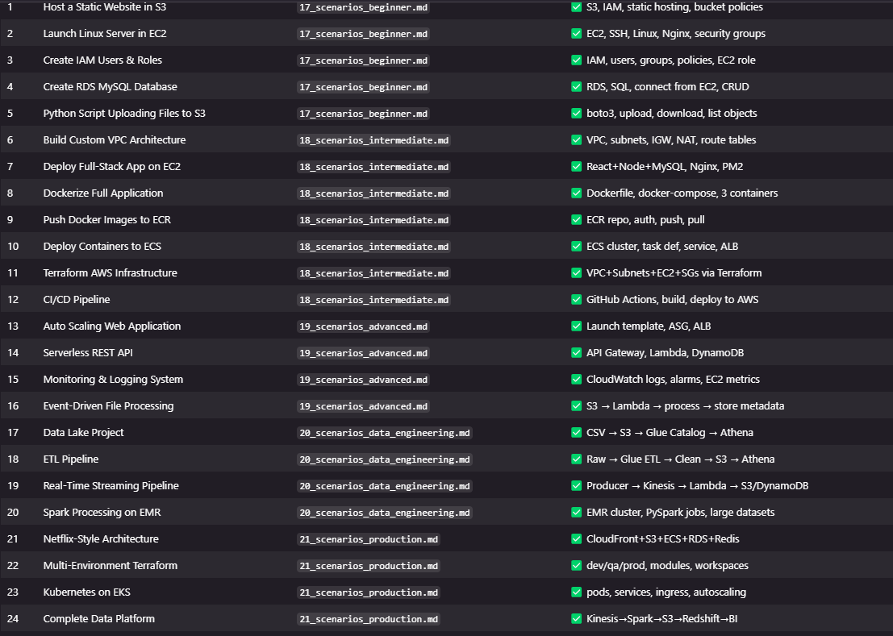

# 🏆 Best Practices Guide — How to Practice Every Scenario

> This guide tells you exactly HOW to practice each scenario for maximum learning.

---

## The 5-Step Practice Method (For EVERY Project)

```
Step 1 — CREATE MANUALLY IN AWS CONSOLE
  Why: Understand every setting visually
  How: Click through the AWS Console, read every option
  Time: 2× longer than CLI, but you learn more

Step 2 — REPEAT USING AWS CLI
  Why: Understand the API behind the UI
  How: Use the commands from each scenario file
  Time: Same as console, but scriptable

Step 3 — AUTOMATE USING TERRAFORM
  Why: Infrastructure as Code — reproducible, version-controlled
  How: Write main.tf for the same resources
  Time: Longer first time, instant on repeat

Step 4 — MONITOR USING CLOUDWATCH
  Why: Production systems need observability
  How: Add CloudWatch alarms and dashboards
  Time: 30 minutes per project

Step 5 — DOCUMENT IN GITHUB
  Why: This becomes your portfolio
  How: README + architecture diagram + code
  Time: 30–60 minutes per project
```

---

## Best Project Order for You

### Start Here (Week 1–2)
```
1. S3 static hosting          → Scenario 1
2. EC2 Linux server           → Scenario 2
3. RDS setup                  → Scenario 4
4. Python boto3 automation    → Scenario 5
```

### Then (Week 3–4)
```
5. VPC architecture           → Scenario 6
6. Dockerized app             → Scenario 8
7. ECS deployment             → Scenario 10
8. Terraform infrastructure   → Scenario 11
```

### Then (Week 5–6)
```
9.  Data lake                 → Scenario 17
10. ETL pipeline              → Scenario 18
11. Kinesis streaming         → Scenario 19
12. Spark on EMR              → Scenario 20
```

---

## Your GitHub Should Contain (For Every Project)

```
project-name/
├── README.md              ← What it does, architecture, how to run
├── architecture.png       ← Diagram (draw.io, Lucidchart, or ASCII)
├── terraform/
│   ├── main.tf
│   ├── variables.tf
│   └── outputs.tf
├── scripts/
│   ├── deploy.sh
│   └── cleanup.sh
├── src/                   ← Application code
├── Dockerfile             ← If containerized
└── docs/
    └── deployment.md      ← Step-by-step with screenshots
```

---

## Scenario Quick Reference — All 24

| # | Scenario | Level | Services | Key Learning |
|---|---------|-------|---------|-------------|
| 1 | Static Website in S3 | 🟢 Beginner | S3, IAM | Object storage, bucket policies |
| 2 | Linux Server in EC2 | 🟢 Beginner | EC2, SSH | Cloud servers, Linux admin |
| 3 | IAM Users & Roles | 🟢 Beginner | IAM | Least privilege, auth |
| 4 | RDS MySQL Database | 🟢 Beginner | RDS, SQL | Managed databases |
| 5 | Python S3 Upload | 🟢 Beginner | S3, Python | AWS SDK, automation |
| 6 | Custom VPC Architecture | 🟡 Intermediate | VPC, Networking | Subnets, routing, NAT |
| 7 | Full Stack App on EC2 | 🟡 Intermediate | EC2, Nginx, PM2 | Production deployment |
| 8 | Dockerize Application | 🟡 Intermediate | Docker | Containerization |
| 9 | Push Images to ECR | 🟡 Intermediate | ECR, Docker | Container registry |
| 10 | Deploy to ECS | 🟡 Intermediate | ECS, Fargate | Container orchestration |
| 11 | Terraform Infrastructure | 🟡 Intermediate | Terraform | Infrastructure as Code |
| 12 | CI/CD Pipeline | 🟡 Intermediate | GitHub Actions | DevOps automation |
| 13 | Auto Scaling Web App | 🔴 Advanced | ALB, ASG | High availability |
| 14 | Serverless REST API | 🔴 Advanced | Lambda, API GW, DynamoDB | Serverless architecture |
| 15 | Monitoring & Logging | 🔴 Advanced | CloudWatch, SNS | Observability |
| 16 | Event-driven Processing | 🔴 Advanced | S3, Lambda | Event architecture |
| 17 | Data Lake Project | ⚫ Data Eng | S3, Glue, Athena | Data lakes, SQL on S3 |
| 18 | ETL Pipeline | ⚫ Data Eng | Glue ETL, PySpark | Transformations |
| 19 | Real-time Streaming | ⚫ Data Eng | Kinesis, Lambda | Streaming systems |
| 20 | Spark on EMR | ⚫ Data Eng | EMR, Spark | Distributed processing |
| 21 | Netflix-style Architecture | 🏆 Production | CloudFront, ECS, Redis | Scalable CDN |
| 22 | Multi-env Terraform | 🏆 Production | Terraform modules | Enterprise IaC |
| 23 | Kubernetes on EKS | 🏆 Production | EKS, kubectl | Advanced orchestration |
| 24 | Complete Data Platform | 🏆 Production | Kinesis+Spark+Redshift | End-to-end DE |

---

## Scenario Tasks Checklist

Use this to track your progress:

### Level 1 — Beginner
- [ ] **Scenario 1**: Create S3 bucket → Enable static hosting → Upload HTML/CSS → Configure public access → Access URL
- [ ] **Scenario 2**: Launch EC2 → Create key pair → SSH into server → Install Nginx → Host webpage
- [ ] **Scenario 3**: Create IAM user → Create group → Attach policies → Create EC2 role
- [ ] **Scenario 4**: Launch MySQL RDS → Connect from EC2 → Create tables → Insert records → SQL practice
- [ ] **Scenario 5**: Install boto3 → Upload files → Download files → List bucket objects

### Level 2 — Intermediate
- [ ] **Scenario 6**: Create VPC → Create subnets → Configure route tables → Configure IGW → Configure NAT
- [ ] **Scenario 7**: Deploy frontend → Deploy backend → Configure reverse proxy → Run app as service
- [ ] **Scenario 8**: Create Dockerfile → Build image → Run container → Create docker-compose
- [ ] **Scenario 9**: Create ECR repository → Authenticate Docker → Push image → Pull image
- [ ] **Scenario 10**: Create ECS cluster → Create task definition → Deploy service → Configure load balancer
- [ ] **Scenario 11**: Create VPC + Subnets + EC2 + Security groups using Terraform only
- [ ] **Scenario 12**: Push code to GitHub → Auto build Docker image → Deploy automatically to AWS

### Level 3 — Advanced
- [ ] **Scenario 13**: Create launch template → Configure ASG → Configure ALB
- [ ] **Scenario 14**: Create REST API → Create Lambda function → Store data in DynamoDB
- [ ] **Scenario 15**: Configure logs → Create alarms → Monitor EC2 metrics
- [ ] **Scenario 16**: S3 Upload → Lambda Trigger → Process File → Store Metadata

### Level 4 — Data Engineering
- [ ] **Scenario 17**: CSV Files → S3 → Glue Catalog → Athena Queries
- [ ] **Scenario 18**: Raw Data → Glue ETL → Clean Data → S3 → Athena
- [ ] **Scenario 19**: Producer → Kinesis → Lambda → S3/Redshift
- [ ] **Scenario 20**: Create EMR cluster → Run PySpark jobs → Process large datasets

### Level 5 — Production
- [ ] **Scenario 21**: CloudFront + S3 + ECS + RDS + Redis (Netflix-style)
- [ ] **Scenario 22**: Multi-environment Terraform (dev / qa / prod)
- [ ] **Scenario 23**: Deploy pods → Services → Ingress → Autoscaling on EKS
- [ ] **Scenario 24**: Kafka/Kinesis → Spark → S3 → Redshift → BI Dashboard

---

## Companion Skills Practice (Alongside AWS)

### Linux Daily Practice
```bash
# Every time you SSH into EC2, practice these:
ls -la /var/log/          # Explore log files
tail -f /var/log/nginx/access.log  # Live logs
ps aux | grep nginx       # Find processes
df -h && free -m          # Check disk and memory
systemctl status nginx    # Service status
grep "ERROR" /var/log/app.log | tail -20  # Find errors
```

### SQL Daily Practice
```sql
-- Practice these patterns every day:
-- 1. Aggregations
SELECT category, COUNT(*), SUM(amount), AVG(amount)
FROM transactions GROUP BY category;

-- 2. Window functions
SELECT user_id, amount,
       SUM(amount) OVER (PARTITION BY user_id ORDER BY created_at) AS running_total
FROM transactions;

-- 3. Joins
SELECT u.name, COUNT(o.id) as orders
FROM users u LEFT JOIN orders o ON u.id = o.user_id
GROUP BY u.name ORDER BY orders DESC;
```

### Terraform Daily Practice
```hcl
# Every infrastructure change → write Terraform first
# Never click in console without writing the Terraform equivalent

# Practice: convert this console action to Terraform
# "Create an S3 bucket with versioning enabled"
resource "aws_s3_bucket" "practice" {
  bucket = "my-practice-bucket"
}
resource "aws_s3_bucket_versioning" "practice" {
  bucket = aws_s3_bucket.practice.id
  versioning_configuration { status = "Enabled" }
}
```

---

## Common Mistakes to Avoid

| Mistake | Impact | Fix |
|---------|--------|-----|
| Only watching videos | No real skills | Build something every day |
| Blindly following tutorials | No understanding | Ask "why" for every step |
| Memorizing services | Useless in interviews | Understand architectures |
| Not cleaning up resources | Unexpected AWS bills | Always run cleanup scripts |
| Not documenting | No portfolio | Push everything to GitHub |
| Skipping networking | Can't debug issues | Master VPC before ECS/EKS |
| Not reading error messages | Slow debugging | Read every error carefully |

---

## Interview Preparation Checklist

After completing all 24 scenarios, you should be able to answer:

### Architecture Questions
- [ ] Design a 3-tier web application on AWS
- [ ] How would you make this highly available?
- [ ] How would you scale this to 1M users?
- [ ] What happens if an AZ goes down?

### Service Questions
- [ ] When would you use Lambda vs EC2 vs ECS?
- [ ] When would you use RDS vs DynamoDB?
- [ ] What is the difference between SQS and SNS?
- [ ] How does VPC peering work?

### Data Engineering Questions
- [ ] Design a data lake architecture
- [ ] How would you process 1TB of daily logs?
- [ ] What is the difference between Kinesis and SQS?
- [ ] When would you use Glue vs EMR?

### Security Questions
- [ ] How do you secure an S3 bucket?
- [ ] What is the principle of least privilege?
- [ ] How do IAM roles differ from IAM users?
- [ ] How do you store secrets securely?

---

*Complete all 24 scenarios → push to GitHub → you're production-ready.*

All 24 scenarios confirmed present. Here's the complete final summary:

✅ All 24 Scenarios Verified — Complete
Scenario Titles (matching the spec exactly):
#	Title	File	Spec Match
1	Host a Static Website in S3	17_scenarios_beginner.md	✅ S3, IAM, static hosting, bucket policies
2	Launch Linux Server in EC2	17_scenarios_beginner.md	✅ EC2, SSH, Linux, Nginx, security groups
3	Create IAM Users & Roles	17_scenarios_beginner.md	✅ IAM, users, groups, policies, EC2 role
4	Create RDS MySQL Database	17_scenarios_beginner.md	✅ RDS, SQL, connect from EC2, CRUD
5	Python Script Uploading Files to S3	17_scenarios_beginner.md	✅ boto3, upload, download, list objects
6	Build Custom VPC Architecture	18_scenarios_intermediate.md	✅ VPC, subnets, IGW, NAT, route tables
7	Deploy Full-Stack App on EC2	18_scenarios_intermediate.md	✅ React+Node+MySQL, Nginx, PM2
8	Dockerize Full Application	18_scenarios_intermediate.md	✅ Dockerfile, docker-compose, 3 containers
9	Push Docker Images to ECR	18_scenarios_intermediate.md	✅ ECR repo, auth, push, pull
10	Deploy Containers to ECS	18_scenarios_intermediate.md	✅ ECS cluster, task def, service, ALB
11	Terraform AWS Infrastructure	18_scenarios_intermediate.md	✅ VPC+Subnets+EC2+SGs via Terraform
12	CI/CD Pipeline	18_scenarios_intermediate.md	✅ GitHub Actions, build, deploy to AWS
13	Auto Scaling Web Application	19_scenarios_advanced.md	✅ Launch template, ASG, ALB
14	Serverless REST API	19_scenarios_advanced.md	✅ API Gateway, Lambda, DynamoDB
15	Monitoring & Logging System	19_scenarios_advanced.md	✅ CloudWatch logs, alarms, EC2 metrics
16	Event-Driven File Processing	19_scenarios_advanced.md	✅ S3 → Lambda → process → store metadata
17	Data Lake Project	20_scenarios_data_engineering.md	✅ CSV → S3 → Glue Catalog → Athena
18	ETL Pipeline	20_scenarios_data_engineering.md	✅ Raw → Glue ETL → Clean → S3 → Athena
19	Real-Time Streaming Pipeline	20_scenarios_data_engineering.md	✅ Producer → Kinesis → Lambda → S3/DynamoDB
20	Spark Processing on EMR	20_scenarios_data_engineering.md	✅ EMR cluster, PySpark jobs, large datasets
21	Netflix-Style Architecture	21_scenarios_production.md	✅ CloudFront+S3+ECS+RDS+Redis
22	Multi-Environment Terraform	21_scenarios_production.md	✅ dev/qa/prod, modules, workspaces
23	Kubernetes on EKS	21_scenarios_production.md	✅ pods, services, ingress, autoscaling
24	Complete Data Platform	21_scenarios_production.md	✅ Kinesis→Spark→S3→Redshift→BI
Additional files created:
00_learning_roadmap.md — Master guide with 7 phases, companion skills (Linux/Docker/Git/Terraform/Python/SQL), daily routine
22_best_practices_guide.md — 5-step practice method, best project order, GitHub portfolio structure, 24-scenario checklist, interview prep checklist
Total 00_handson folder: 25 files (23 markdown + 1 docx + 1 README)
Est. Credits Used: 10.27
Elapsed time: 3m 9s



Complete Hands-on Scenarios Roadmap

For Amazon Web Services + Linux + Docker + Terraform + Python + SQL

The goal is:

not just learning services
but learning how real systems are built
LEVEL 1 — Beginner Hands-on Scenarios

Goal:
Understand basic cloud workflow.

Scenario 1 — Host a Static Website in S3
Skills
S3
IAM
Static website hosting
Tasks
Create S3 bucket
Enable static hosting
Upload HTML/CSS files
Configure public access
Access website URL
Learn
object storage
bucket policies
permissions
public vs private access
Scenario 2 — Launch Linux Server in EC2
Skills
EC2
SSH
Linux basics
Tasks
Launch EC2
Create key pair
SSH into server
Install Nginx
Host webpage
Linux Commands
ssh
sudo
apt
yum
systemctl
Learn
cloud servers
Linux administration
security groups
Scenario 3 — Create IAM Users & Roles
Skills
IAM
Security
Tasks
Create IAM user
Create group
Attach policies
Create EC2 role
Learn
least privilege
access management
AWS authentication
Scenario 4 — Create RDS MySQL Database
Skills
RDS
SQL
Networking basics
Tasks
Launch MySQL RDS
Connect from EC2
Create tables
Insert records
SQL Practice

SELECT∗FROMusersWHEREage>25

Learn
managed databases
DB security
connectivity
Scenario 5 — Python Script Uploading Files to S3
Skills
Python
boto3
S3
Tasks
Install boto3
Upload files
Download files
List bucket objects
Learn
AWS SDK
automation
scripting
LEVEL 2 — Intermediate Hands-on Scenarios

Goal:
Build real application infrastructure.

Scenario 6 — Build Custom VPC Architecture
Skills
Networking
VPC
Routing
Architecture
VPC
├── Public Subnet
│   └── EC2
└── Private Subnet
    └── RDS
Tasks
Create VPC
Create subnets
Configure route tables
Configure Internet Gateway
Configure NAT
Learn
cloud networking
subnet isolation
secure architectures
Scenario 7 — Deploy Full Stack App on EC2
Stack
React frontend
Node backend
MySQL database
Skills
Linux
EC2
Nginx
PM2
Tasks
Deploy frontend
Deploy backend
Configure reverse proxy
Run app as service
Learn
application deployment
production setup
Scenario 8 — Dockerize Full Application
Skills
Docker
Containers
Tasks
Create Dockerfile
Build image
Run container
Create docker-compose
Architecture
Frontend Container
Backend Container
Database Container
Learn
containerization
environment consistency
Scenario 9 — Push Docker Images to ECR
Skills
Docker
ECR
Tasks
Create ECR repository
Authenticate Docker
Push image
Pull image
Learn
container registry
deployment workflows
Scenario 10 — Deploy Containers to ECS
Skills
ECS
Fargate
Tasks
Create ECS cluster
Create task definition
Deploy service
Configure load balancer
Learn
container orchestration
scalable deployments
Scenario 11 — Terraform AWS Infrastructure
Skills
Terraform
IaC
Tasks

Create:

VPC
Subnets
EC2
Security groups

using Terraform only.

Learn
infrastructure automation
reproducible deployments
Scenario 12 — CI/CD Pipeline
Skills
GitHub Actions
AWS deployment
Tasks
Push code to GitHub
Auto build Docker image
Deploy automatically to AWS
Learn
DevOps workflow
automation
LEVEL 3 — Advanced Hands-on Scenarios

Goal:
Think like production engineer.

Scenario 13 — Auto Scaling Web Application
Skills
Load Balancer
Auto Scaling
Tasks
Create launch template
Configure ASG
Configure ALB
Learn
high availability
scalability
Scenario 14 — Serverless REST API
Stack
API Gateway
Lambda
DynamoDB
Tasks
Create REST API
Create Lambda function
Store data in DynamoDB
Learn
serverless architecture
event-driven systems
Scenario 15 — Monitoring & Logging System
Skills
CloudWatch
Logging
Tasks
Configure logs
Create alarms
Monitor EC2 metrics
Learn
observability
monitoring
Scenario 16 — Event-driven File Processing
Flow
S3 Upload
→ Lambda Trigger
→ Process File
→ Store Metadata
Skills
S3 events
Lambda
Python
Learn
automation
event architecture
LEVEL 4 — Data Engineering Hands-on

Very important for your path.

Scenario 17 — Data Lake Project
Architecture
CSV Files
→ S3
→ Glue Catalog
→ Athena Queries
Skills
S3
Glue
Athena
Learn
data lakes
metadata cataloging
Scenario 18 — ETL Pipeline
Flow
Raw Data
→ Glue ETL
→ Clean Data
→ S3
→ Athena
Learn
ETL
transformations
Scenario 19 — Real-time Streaming Pipeline
Flow
Producer
→ Kinesis
→ Lambda
→ S3/Redshift
Learn
streaming systems
real-time analytics
Scenario 20 — Spark Processing on EMR
Skills
Spark
EMR
Tasks
Create EMR cluster
Run PySpark jobs
Process large datasets
Learn
distributed processing
big data systems
LEVEL 5 — Production-grade Projects
Scenario 21 — Netflix-style Architecture
Components
CloudFront
S3
ECS
RDS
Redis
Learn
scalable architecture
caching
CDN
Scenario 22 — Multi-environment Terraform Setup
Environments
dev
qa
prod
Learn
enterprise IaC
reusable modules
Scenario 23 — Kubernetes on EKS
Skills
Kubernetes
EKS
Tasks
Deploy pods
Services
Ingress
Autoscaling
Learn
advanced orchestration
Scenario 24 — Complete Data Platform
Architecture
Kafka/Kinesis
→ Spark
→ S3
→ Redshift
→ BI Dashboard
Learn
end-to-end data engineering
BEST WAY TO PRACTICE

For EVERY project:

Step 1

Create manually in AWS Console

Step 2

Repeat using AWS CLI

Step 3

Automate using Terraform

Step 4

Monitor using CloudWatch

Step 5

Document in GitHub

Your GitHub Should Contain

For every project:

README.md
Architecture Diagram
Terraform Files
Deployment Steps
Screenshots

This becomes your portfolio.

BEST PROJECT ORDER FOR YOU
Start Here
S3 static hosting
EC2 Linux server
RDS setup
Python boto3 automation
Then
VPC architecture
Dockerized app
ECS deployment
Terraform infrastructure
Then
Data lake
ETL pipeline
Kinesis streaming
Spark on EMR

That progression is excellent for your direction.